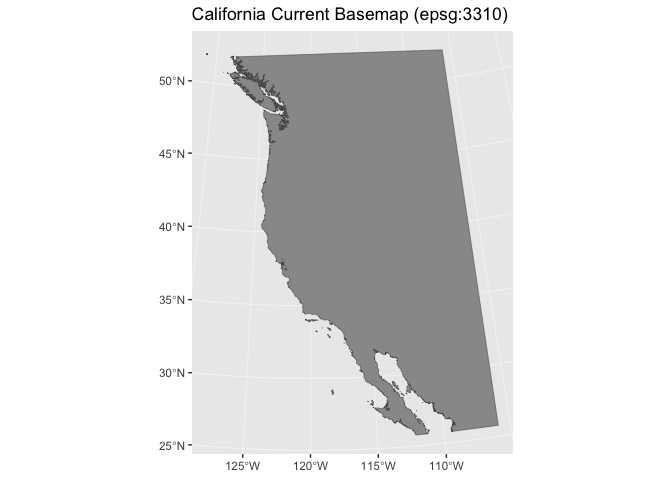

<!-- README.md is generated from README.Rmd. Please edit that file -->
nPacMaps: an R package for North Pacific basemap data
=====================================================

About
-----

Creating maps for the North Pacific can be difficult, frustrating, and confusing. The main source of this frustration is the 180 longitude line and the limited examples that exist for guidance. This R package relies on data from the [Global Self-consistent, Hierarchical, High-resolution Geography (GSHHG) Database](https://www.soest.hawaii.edu/pwessel/gshhg/).

The main objective is to provide a simple interface for quickly loading basemap polygon land data for the North Pacific Region that can be used in either the ggplot2 or sp:spplot graphical ecosystems.

This package is under active development and functionality is subject to change and improvement at anytime.

Installation
------------

The nPacMaps package is not available on CRAN and must be installed via the `devtools::install_github()` function.

``` r
install.packages("devtools")
devtools::install_github('jmlondon/npacmaps',ref='develop')
```

After successfully installing the package from GitHub, you will need to download and install the GSHGG data. This is handled via the `nPacMaps::install_gshhg()` function.

``` r
library(nPacMaps)
install_gshhg()
```

Resolution
----------

The GSHHG dataset has five different resolutions available:

1.  **f**ull resolution: Original (full) data resolution.
2.  **h**igh resolution: About 80 % reduction in size and quality.
3.  **i**ntermediate resolution: Another ~80 % reduction.
4.  **l**ow resolution: Another ~80 % reduction.
5.  **c**rude resolution: Another ~80 % reduction.

The **i**ntermediate reolustion has been set as the default option and should suffice for most applications. The default resolution can be overided via the `resolution` parameter. Users should consider bumping up to **h**igh or **f**ull when zooming into smaller scale regions. This will increase the extraction and drawing time. If you require the **f**ull resolution frequently, creating a custom region via `extract_gshhg()` should be considered.

Projections
-----------

All of the returned maps are provide with projected coordinates in a default projection chosen for each region. In most cases, the default projections are sensible and all users need to do is insure all other data is transformed to the same projection. A custom projection can be provided by specifying the corresponding epsg integer value (as a character) to the `epsg` parameter.

Fortify for ggplot2
-------------------

By default all of the basemap objects are returned as a `data.frame` that has been *fortified* via the `ggplot2::fortify()` function. If you would like, instead, for the object to be returned as a *SpatialPolygonsDataFrame* for use with `plot()` or `sp::spplot()` then the `fortify` parameter should be specified as `FALSE`.

Additional Utility Functions
----------------------------

The package also includes two additional utility functions: `to_km()` and `ggExpansion()`. The `to_km()` function provides simple conversion of the easting and northing labels from meters to kilometers. The `ggExpansion()` function allows the user to easily specify an expansion fraction for the xlim and ylim components of the ggplot.

Examples
--------

### North Pacific Basemap

``` r
library(ggplot2)
library(nPacMaps)
#> Loading required package: maptools
#> Loading required package: sp
#> Checking rgeos availability: TRUE
#> nPacMaps 2.0 (2016-07-05) 
#>  The nPacMaps package requires an additional installation step.
#>  Please type 'install_gshhg()' to complete this install.

npac_base <- nPacMaps::npac()
#> Data are polygon data
#> Rgshhs: clipping 7 of 2251 polygons ...

npac_plot <- ggplot() + 
  geom_polygon(data = npac_base,
               aes(x = long,y = lat,group = group,id = id),
               fill = "grey60") +
  coord_fixed() +
  xlab("easting (km)") + ylab("northing (km)") +
  scale_x_continuous(labels = nPacMaps::to_km()) +
  scale_y_continuous(labels = nPacMaps::to_km()) +
  ggtitle('North Pacific Basemap (epsg:3832)')
npac_plot
```


### California Current

``` r
library(ggplot2)
library(nPacMaps)

calcur_base <- nPacMaps::calcur()
#> Data are polygon data
#> Rgshhs: clipping 8 of 471 polygons ...

calcur_plot <- ggplot() + 
  geom_polygon(data = calcur_base,
               aes(x = long,y = lat,group = group,id = id),
               fill = "grey60") +
  coord_fixed() +
  xlab("easting (km)") + ylab("northing (km)") +
  scale_x_continuous(labels = nPacMaps::to_km()) +
  scale_y_continuous(labels = nPacMaps::to_km()) +
  ggtitle('California Current Basemap (epsg:3310)')
calcur_plot
```



### Bering Sea Basemap

``` r
library(ggplot2)
library(nPacMaps)

bering_base <- nPacMaps::bering()
#> Data are polygon data
#> Rgshhs: clipping 9 of 1105 polygons ...

bering_plot <- ggplot() + 
  geom_polygon(data = bering_base,
               aes(x = long,y = lat,group = group,id = id),
               fill = "grey60") +
  coord_fixed() +
  xlab("easting (km)") + ylab("northing (km)") +
  scale_x_continuous(labels = nPacMaps::to_km()) +
  scale_y_continuous(labels = nPacMaps::to_km()) +
  ggtitle('Bering Sea Basemap (epsg:3571)')
bering_plot
```


### US (Alaska) Arctic Basemap

``` r
library(ggplot2)
library(nPacMaps)

us_arctic_base <- nPacMaps::us_arctic()
#> Data are polygon data
#> Rgshhs: clipping 10 of 483 polygons ...

us_arctic_plot <- ggplot() + 
  geom_polygon(data = us_arctic_base,
               aes(x = long,y = lat,group = group,id = id),
               fill = "grey60") +
  coord_fixed() +
  xlab("easting (km)") + ylab("northing (km)") +
  scale_x_continuous(labels = nPacMaps::to_km()) +
  scale_y_continuous(labels = nPacMaps::to_km()) +
  ggtitle('US Arctic Basemap (epsg:3572)')
us_arctic_plot
```


### Alaska Basemap

``` r
library(ggplot2)
library(nPacMaps)

ak_base <- nPacMaps::alaska()
#> Data are polygon data
#> Rgshhs: clipping 5 of 1380 polygons ...

ak_plot <- ggplot() + 
  geom_polygon(data = ak_base,
               aes(x = long,y = lat,group = group,id = id),
               fill = "grey60") +
  coord_fixed() +
  xlab("easting (km)") + ylab("northing (km)") +
  scale_x_continuous(labels = nPacMaps::to_km()) +
  scale_y_continuous(labels = nPacMaps::to_km()) +
  ggtitle('Alaska Basemap (epsg:3338)')
ak_plot
```


We can also zoom in on a particular region

``` r
library(ggplot2)
library(nPacMaps)
library(crawl)
#> crawl 2.0 (2016-02-24) 
#>  Type 'vignette('crawl_intro')' to see examples of package use, and
#>  'demo(package='crawl')' will provide a list of demos.
#>  The raw code for the demos can be found by typing:
#>  'system.file('demo', package='crawl')'
library(dplyr)
#> 
#> Attaching package: 'dplyr'
#> The following objects are masked from 'package:stats':
#> 
#>     filter, lag
#> The following objects are masked from 'package:base':
#> 
#>     intersect, setdiff, setequal, union

data("harborSeal")

harborSeal <- harborSeal %>% filter(!is.na(latitude)) %>% 
  as.data.frame()

sp::coordinates(harborSeal) <- ~longitude + latitude
sp::proj4string(harborSeal) <- CRS("+init=epsg:4326")

harborSeal <- sp::spTransform(harborSeal, CRS("+init=epsg:3338"))
harborSeal <- as.data.frame(harborSeal)

map_limits <- nPacMaps::ggExpansion(harborSeal,x = "longitude",y = "latitude",
                                    x_fac = 0.25, y_fac = 0.25)

ak_base <- nPacMaps::alaska(resolution = "f")
#> Data are polygon data
#> Rgshhs: clipping 5 of 7494 polygons ...

ak_plot <- ggplot() + 
  geom_polygon(data = ak_base,
               aes(x = long,y = lat,group = group,id = id),
               fill = "grey60") +
  geom_point(data = harborSeal,aes(x = longitude, y = latitude), 
             alpha = 0.1, color = 'blue') +
  coord_fixed(xlim = map_limits$xlim, ylim = map_limits$ylim) +
  xlab("easting (km)") + ylab("northing (km)") +
  scale_x_continuous(labels = nPacMaps::to_km()) +
  scale_y_continuous(labels = nPacMaps::to_km())
ak_plot
```


------------------------------------------------------------------------

##### Disclaimer

<sub>This repository is a scientific product and is not official communication of the Alaska Fisheries Science Center, the National Oceanic and Atmospheric Administration, or the United States Department of Commerce. All AFSC Marine Mammal Laboratory (AFSC-MML) GitHub project code is provided on an ‘as is’ basis and the user assumes responsibility for its use. AFSC-MML has relinquished control of the information and no longer has responsibility to protect the integrity, confidentiality, or availability of the information. Any claims against the Department of Commerce or Department of Commerce bureaus stemming from the use of this GitHub project will be governed by all applicable Federal law. Any reference to specific commercial products, processes, or services by service mark, trademark, manufacturer, or otherwise, does not constitute or imply their endorsement, recommendation or favoring by the Department of Commerce. The Department of Commerce seal and logo, or the seal and logo of a DOC bureau, shall not be used in any manner to imply endorsement of any commercial product or activity by DOC or the United States Government.</sub>
